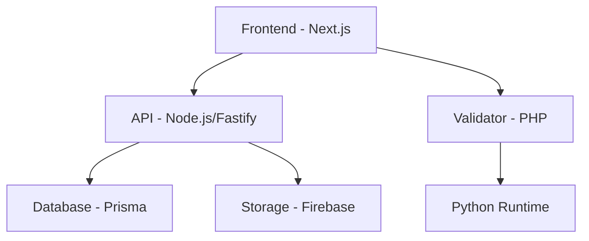
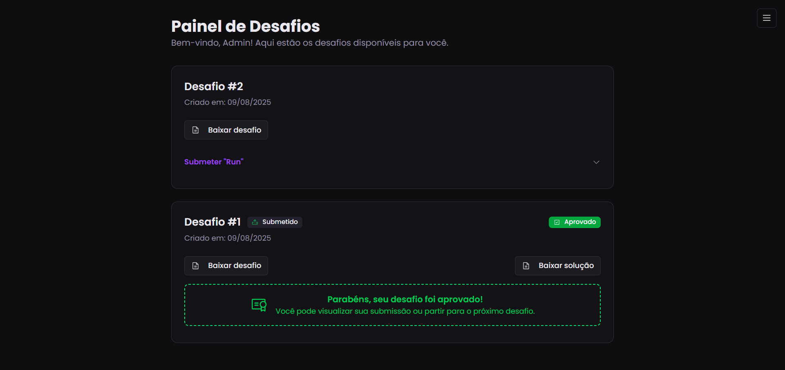
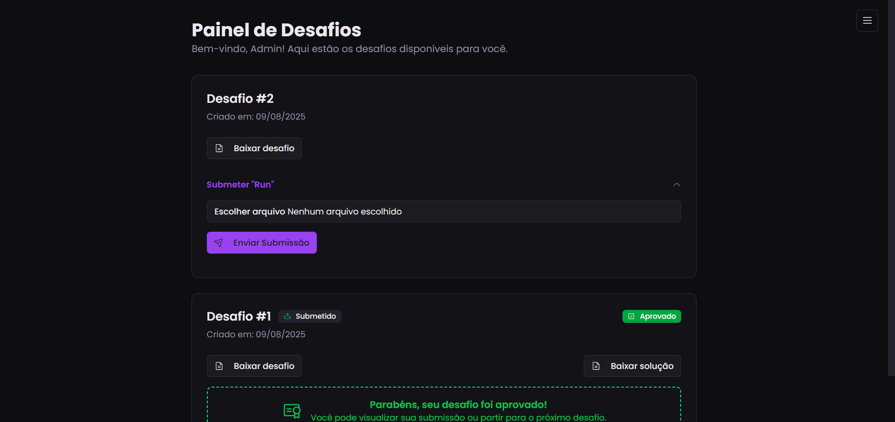
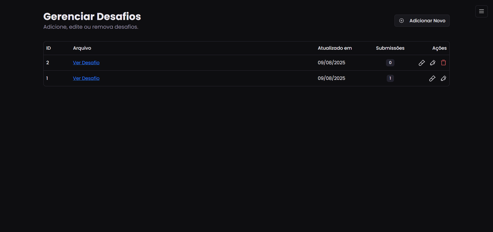
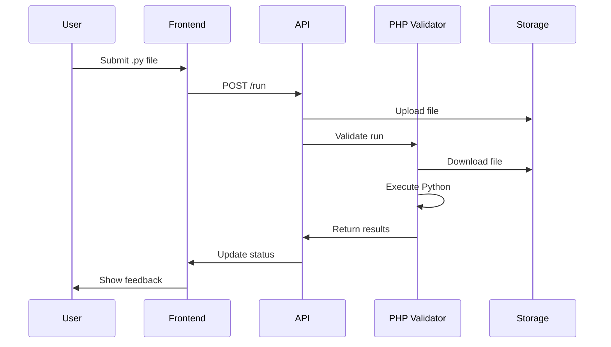

# CodeUp 🚀

> **Sua jornada no mundo dev cresce aqui.**

Uma plataforma completa para desenvolvedores aprimorarem suas habilidades através de desafios práticos de programação com validação automática.

[](https://nodejs.org/)
[](https://nextjs.org/)
[](https://www.typescriptlang.org/)
[](https://php.net/)
[](https://docker.com/)

---

## 📋 Sobre o Projeto

O **CodeUp** é uma plataforma educacional que permite aos desenvolvedores:

- ✅ **Resolver desafios** de programação em Python
- 📤 **Submeter soluções** através de upload de arquivos
- 🧪 **Validação automática** com casos de teste personalizados
- 📊 **Acompanhar progresso** com status de aprovação/reprovação
- 👨‍💼 **Gerenciar desafios** (para administradores)
- 🔐 **Sistema completo** de autenticação e autorização

---

## 🏗️ Arquitetura



### 🛠️ Stack Tecnológica

| Componente          | Tecnologia               | Versão |
| ------------------- | ------------------------ | ------ |
| **Frontend**        | Next.js + TypeScript     | 14+    |
| **Backend API**     | Node.js + Fastify        | 18+    |
| **Validador**       | PHP                      | 8.3    |
| **Banco de Dados**  | PostgreSQL + Prisma      | -      |
| **Storage**         | Firebase Storage         | -      |
| **UI/UX**           | Tailwind CSS + Shadcn/UI | -      |
| **Autenticação**    | NextAuth.js              | -      |
| **Containerização** | Docker + Docker Compose  | -      |

---

## 🚀 Início Rápido

### Pré-requisitos

- **Docker** e **Docker Compose** instalados
- **Node.js 18+** (opcional, para desenvolvimento)
- **pnpm** (gerenciador de pacotes)

### 1. Clone o Repositório

```bash
git clone https://github.com/seu-usuario/codeup.git
cd codeup
```

### 2. Configure as Variáveis de Ambiente

```bash
# Copie os arquivos de exemplo
cp .env.example .env
cp next/.env.example next/.env
cp nodejs/.env.example nodejs/.env
cp php/.env.example php/.env
```

### 3. Execute com Docker

```bash
# Construa e inicie todos os serviços
pnpm docker-compose:prod
```

### 4. Acesse a Aplicação

| Serviço               | URL                   | Descrição            |
| --------------------- | --------------------- | -------------------- |
| **Frontend**          | http://localhost:3000 | Interface principal  |
| **API Node.js**       | http://localhost:3030 | API REST             |
| **Validador PHP**     | http://localhost:8080 | Serviço de validação |
| **Firebase Emulator** | http://localhost:4000 | Storage emulado      |

---

## 📁 Estrutura do Projeto

```
codeup/
├── 🌐 next/                    # Frontend Next.js
│   ├── src/
│   │   ├── app/               # App Router
│   │   ├── components/        # Componentes UI
│   │   ├── modules/           # Módulos específicos
│   │   │   ├── auth/         # Autenticação
│   │   │   ├── challenge/    # Gerenciar desafios
│   │   │   ├── dashboard/    # Dashboard usuário
│   │   │   └── test-case/    # Casos de teste
│   │   └── hooks/            # Custom hooks
│   └── prisma/               # Schema do banco
│
├── 🔧 nodejs/                  # API Backend
│   ├── src/
│   │   ├── config/           # Configurações
│   │   ├── routes/           # Rotas da API
│   │   │   ├── challenge/    # CRUD desafios
│   │   │   ├── test-case/    # Casos de teste
│   │   │   ├── run/          # Submissões
│   │   │   └── user/         # Usuários
│   │   ├── services/         # Lógica de negócio
│   │   ├── middlewares/      # Middlewares
│   │   └── schemas/          # Validação Zod
│   └── prisma/               # Migrações
│
├── 🐘 php/                     # Validador de Código
│   └── index.php             # Executor Python
│
└── 🐳 docker-compose.yml       # Orquestração
```

---

## 🎯 Funcionalidades Principais

### 👤 **Para Estudantes**

- **Dashboard intuitivo** com lista de desafios
- **Download de enunciados** (PDFs)
- **Submit de soluções** (.py)
- **Feedback automático** (Aprovado/Reprovado)
- **Histórico de submissões**
- **Resubmissão** de soluções

### 👨‍💼 **Para Administradores**

- **CRUD completo** de desafios
- **Upload de enunciados** (PDF)
- **Gerenciar casos de teste** (entrada/saída)
- **Monitorar submissões**
- **Sistema de permissões**

### 🧪 **Validação Automática**

- **Execução segura** de código Python
- **Comparação** com casos de teste
- **Tratamento de erros**
- **Feedback detalhado**

---

## 🖥️ Interface

### 🎨 Design System

- **Tema escuro** com paleta roxa/violeta
- **Componentes modernos** com Shadcn/UI
- **Responsivo** para mobile e desktop
- **Animações suaves** e micro-interações

### 📱 Screenshots

| Dashboard                        | Submissão                  | Gerenciar                |
| -------------------------------- | -------------------------- | ------------------------ |
|  |  |  |

---

## 🔧 Desenvolvimento Local

### Frontend (Next.js)

```bash
cd next
pnpm install
pnpm dev
```

### Backend (Node.js)

```bash
cd nodejs
pnpm install
pnpm dev
```

### Banco de Dados

```bash
cd nodejs
npx prisma migrate dev
npx prisma studio
```

---

## 📊 API Endpoints

### 🏆 Challenges

```http
GET    /challenge           # Listar desafios
POST   /challenge           # Criar desafio (Admin)
PUT    /challenge/:id       # Atualizar desafio (Admin)
DELETE /challenge/:id       # Deletar desafio (Admin)
```

### 🧪 Test Cases

```http
GET    /test-case/:challengeId    # Listar casos de teste
POST   /test-case                 # Criar caso de teste (Admin)
PUT    /test-case/:id             # Atualizar caso (Admin)
DELETE /test-case/:id             # Deletar caso (Admin)
```

### 🏃‍♂️ Runs (Submissões)

```http
POST   /run                 # Submeter solução
PUT    /run/:id             # Atualizar submissão
GET    /run/validate/:id    # Validar submissão
```

### 👤 Users

```http
POST   /user/login          # Login
POST   /user/register       # Registro
GET    /user/profile        # Perfil
```

---

## 🔐 Autenticação

O sistema utiliza **NextAuth.js** com:

- **JWT Tokens** para sessões
- **Credentials Provider** para login
- **Role-based access** (User/Admin)
- **Protected routes** no frontend e backend
- **Middleware auth** no frontend e backend

---

## 🐳 Docker

### Serviços Disponíveis

```yaml
services:
  next: # Frontend Next.js (porta 3000)
  nodejs: # API Backend (porta 3030)
  php: # Validador PHP (porta 8080)
  firebase: # Storage Emulator (porta 4000)
```

### Comandos Úteis

1. **Iniciar todos os serviços em build**

```bash
pnpm docker-compose:prod
```

2. **Iniciar todos os serviços em modo desenvolvimento**

```bash
pnpm docker-compose:dev
```

3. **Derrubar todos os serviços**

```bash
pnpm docker-compose:down
```

---

## 📝 Scripts Disponíveis

### Frontend (Next.js)

```json
{
  "dev": "next dev -p 3001",
  "dev:turbopack": "next dev --turbopack -p 3000",
  "build": "next build",
  "start": "next start",
  "lint": "next lint"
}
```

### Backend (Node.js)

```json
{
  "seed": "tsx services/seed.ts",
  "dev": "tsx watch src/app.ts",
  "build": "tsup src --format esm --external @prisma/generated/prisma",
  "start": "node dist/app.js",
  "generate": "pnpx prisma generate",
  "migrate": "pnpx prisma migrate",
  "studio": "pnpx prisma studio",
  "format": "pnpx prisma format"
}
```

---

## 🧪 Como Funciona a Validação

1. **Upload**: Usuário faz upload da solução (.py)
2. **Storage**: Arquivo é salvo no Firebase Storage
3. **Trigger**: Sistema aciona o validador PHP
4. **Execução**: PHP executa o código Python com os casos de teste
5. **Comparação**: Saída é comparada com a esperada
6. **Resultado**: Feedback é retornado (Aprovado/Reprovado)



---

## 🛡️ Segurança

- **Execução isolada** de código Python
- **Sanitização** de entradas
- **Rate limiting** nas APIs
- **CORS** configurado
- **Validação** com Zod schemas
- **Autenticação JWT**

---

## 🌟 Próximas Features

- [ ] **Ranking** de usuários
- [ ] **User Levels** (níveis de usuário)
- [ ] **Gamification** (pontos, badges, etc.)
- [ ] **Pet** (adicionar um mascote que acompanha seu desenvolvimento)
- [ ] **Achievements** (conquistas)

---

## 🤝 Contribuição

1. **Fork** o projeto
2. **Crie** uma branch (`git checkout -b feature/AmazingFeature`)
3. **Commit** suas mudanças (`git commit -m 'Add AmazingFeature'`)
4. **Push** para a branch (`git push origin feature/AmazingFeature`)
5. **Abra** um Pull Request

---

## 📄 Licença

Este projeto está sob a licença **MIT**. Veja o arquivo [LICENSE](LICENSE) para mais detalhes.

---

## 👥 Equipe

Desenvolvido com ❤️ por desenvolvedores apaixonados por educação e tecnologia.

---

## 🆘 Suporte

Encontrou algum problema? Abra uma [issue](https://github.com/seu-usuario/codeup/issues) ou entre em contato!

---

## 📝 Notas

- Esse é um projeto que ainda está em desenvolvimento e planejo muitas melhoras, porém no momento, possuo outras ocupações. 

- Pretendo redesenhar o design, para adicionar mais recursos e melhorar a experiência do usuário. Em futuro indeterminado, espero poder dedicar mais tempo a ele.

- Agradeço a compreensão de todos!

---


<div align="center">

**CodeUp** - Sua jornada no mundo dev cresce aqui! 🚀

<!-- [🌐 Website](https://codeup.dev) • [📚 Docs](https://docs.codeup.dev) • [💬 Discord](https://discord.gg/codeup) -->

</div>
